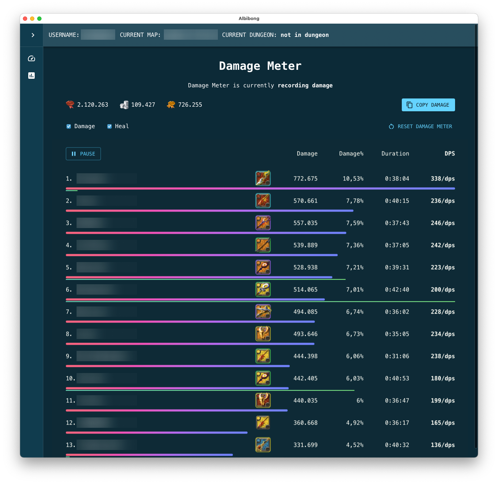
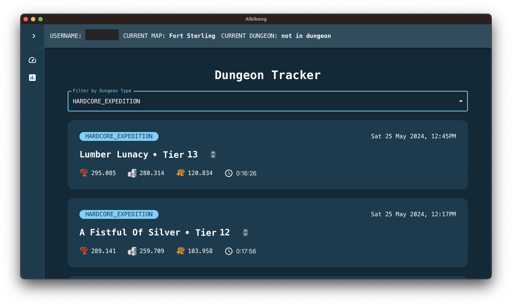
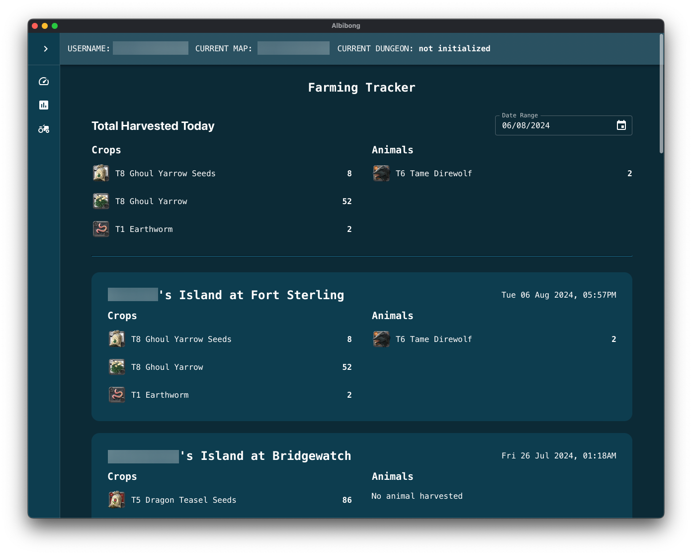
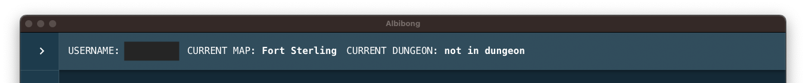

# Albibong

[](https://discord.gg/tHztGJ2QYT)
[](https://pypi.org/project/albibong/)
[](https://pypi.org/project/albibong/)

### Optimized for Mac

❗️ Untested in Windows and Linux, I don't have those machines :( ❗️

## 🎯 Features

1. Damage (and Heal) Meter
   
   - Pause and Resume damage and heal logging
   - Copy damage rank to clipboard
   - Reset damage, heal, and player stats
2. Dungeon Tracker
   
   - Automatically track dungeon name, fame gained, silver gained, respec points gained, start time, dungeon duration and dps meter snapshot.
   - Change recorded dungeon name
   - Add dungeon tier/level
   - Filter dungeon by dungeon types
3. Farming Tracker
   
   - Automatically track harvested crops and animals in an island
   - See farming recap of a specific day

## How to Install

### Prerequisites

- You need Python 3.10 and above
- Ability to type or copy paste in your computer's Terminal or Command Line

### 🔰 Casual Users

1. Install Albibong through pip

```
pip install albibong
```

### 👨‍💻 Devs

**It is recommended to use virtualenv**

1. Install the Backend inside `src/albibong`

```
cd src && pip install -r albibong/requirements.txt
```

2. Install the Frontend inside `gui`

```
cd gui && npm install
```

## How to Run The Program

### ‼️ Important Note ‼️

- For better party member detection, turn on Albibong first before joining a party. If you are already in a party, you can leave the party then join again.

- You need to change location (zone to another map) to initialize your character
  - Character Not Yet Initialized
    
  - Successfully Initialized Character
    

### 🔰 Casual Users

1. Run Albibong by typing `albibong` on your terminal

```
albibong
```

2. A window will pop out and you're good to go!

**Can't run the program?** Refer to [FAQ](#-faq)

### 👨‍💻 Devs

1. Clone this repository

2. Run the Backend inside `src`

```
cd src && python -m albibong
```

3. Run the Frontend inside `gui`

```
cd gui && npm run dev
```

4. You can now access the GUI by going to http://localhost:5173/
5. See logs and saved dungeon data on `~/Albibong/`

## ❓ FAQ

### _"I can't run Albibong by typing Albibong"_

#### Common Mac Problems

If you encounter this problem

```
scapy.error.Scapy_Exception: Permission denied: could not open /dev/bpf0. Make sure to be running Scapy as root ! (sudo)
```

Use `sudo albibong` to start Albibong.

#### Common Windows Problems

If you encounter this problem

```
'albibong' is not recognized as an internal or external command, operable program or batch file.
```

Add PIP package to path by following this guide https://youtu.be/9_WyyV_66rU?si=0shXXv59MBeQBHiH


For WARNING: No libpcap provider available ! pcap won't be used
Thread sniffer started

```
WARNING: No libpcap provider available ! pcap won't be used
Thread sniffer started
Exception in thread AsyncSniffer:
Traceback (most recent call last):
Thread packet_handler started
  File "C:\Users\USER\AppData\Local\Programs\Python\Python39\lib\threading.py", line 973, in _bootstrap_inner
Thread ws_server started
    self.run()
  File "C:\Users\USER\AppData\Local\Programs\Python\Python39\lib\threading.py", line 910, in run
    self._target(*self._args, **self._kwargs)
  File "C:\Users\USER\AppData\Local\Programs\Python\Python39\lib\site-packages\scapy\sendrecv.py", line 1171, in _run
    sniff_sockets[_RL2(iface)(type=ETH_P_ALL, iface=iface,
  File "C:\Users\USER\AppData\Local\Programs\Python\Python39\lib\site-packages\scapy\arch\windows__init.py", line 1019, in init__
    raise RuntimeError(
RuntimeError: Sniffing and sending packets is not available at layer 2: winpcap is not installed. You may use conf.L3socket orconf.L3socket6 to access layer 3
```

Install (NPCAP)[https://npcap.com/#download)

## Working version
```
python3 --version
Python 3.9.6
```

```
node --version
v23.6.1
```

In case you are on windows and by mistake you will install to many version of python check it ->
```
py -3.9 --version
```

If this will works you need to install and run backend with this commands
```
py -3.9 -m albibong
py -3.9 -m pip install -r albibong/requirements.txt
```

### _"Can I use the tool with ExitLag, 1.1.1.1 or VPN?"_

No, this is not possible. If Albion is blocked in your country, I suggest to add Albion's servers to your hosts file.

## 🤝🏼 Credits

- Event and Operation Codes based on [AlbionOnline-StatisticsAnalysis](https://github.com/Triky313/AlbionOnline-StatisticsAnalysis) with modifications
- Map and Item Codes based on [ao-bin-dumps](https://github.com/ao-data/ao-bin-dumps) with modifications
- Use of [photon-packet-parser](https://github.com/santiac89/photon-packet-parser) with modifications
- Use of [deatheye](https://github.com/pxlbit228/albion-radar-deatheye-2pc/blob/master/Radar/Packets/Handlers/MoveEvent.cs)
