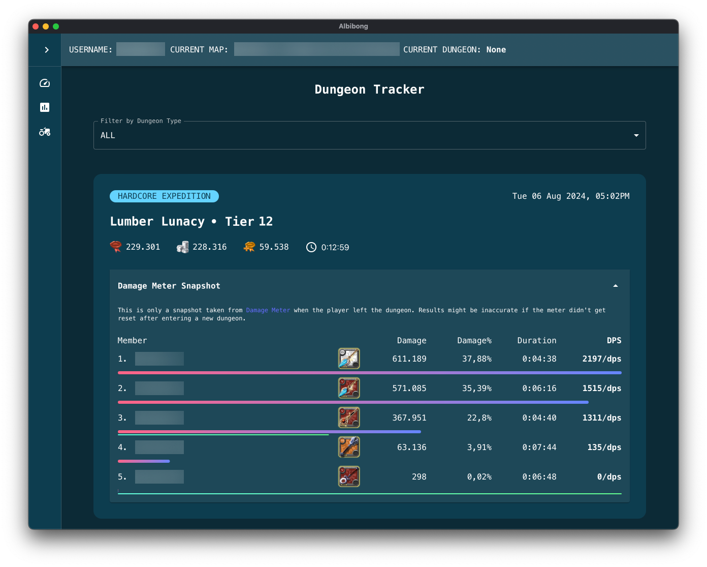

# Albibong

## 🎯 Features

1. Damage (and Heal) Meter
   
   - Pause and Resume damage and heal logging
   - Copy damage rank to clipboard
   - Reset damage and heal
2. Dungeon Tracker
   
   - Automatically track dungeon name, fame gained, silver gained, respec points gained, start time and dungeon duration.
   - Ability to change recorded dungeon name
   - Ability to add dungeon tier/level
   - Filter dungeon by dungeon types

## How to Install

### Prerequisites

- You need Python 3.8 and above
- Ability to type or copy paste in your computer's Terminal or Command Line

### 🔰 Casual Users

1. Install Albibong through pip

```
pip install albibong
```

### 👨‍💻 Devs

**It is recommended to use virtualenv**

1. Install the Backend inside `src/albibong`

```
cd src && pip install -r albibong/requirements.txt
```

2. Install the Frontend inside `gui`

```
cd gui && npm install
```

## How to Run The Program

### ‼️ Important Note ‼️

- For better party member detection, turn on Albibong first before joining a party. If you are already in a party, you can leave the party then join again.

- You need to change location (zone to another map) to initialize your character
  - Character Not Yet Initialized
    
  - Successfully Initialized Character
    

### 🔰 Casual Users

1. Run Albibong by typing `albibong` on your terminal

```
albibong
```

3. A window will pop out and you're good to go!

### 👨‍💻 Devs

1. Clone this repository

2. Run the Backend inside `src`

```
cd src && python albibong
```

3. Run the Frontend inside `gui`

```
cd gui && npm run dev
```

4. You can now access the GUI by going to http://localhost:5173/
5. See logs and saved dungeon data on `~/Albibong/`

## ❓ FAQ

### Can I use the tool with ExitLag, 1.1.1.1 or VPN?

No, this is not possible. If Albion is blocked in your country, I suggest to add Albion's servers to your hosts file.

## 🤝🏼 Credits

- Event and Operation Codes based on [AlbionOnline-StatisticsAnalysis](https://github.com/Triky313/AlbionOnline-StatisticsAnalysis) with modifications
- Map and Item Codes based on [ao-bin-dumps](https://github.com/ao-data/ao-bin-dumps) with modifications
- Use of [photon-packet-parser](https://github.com/santiac89/photon-packet-parser) with modifications
